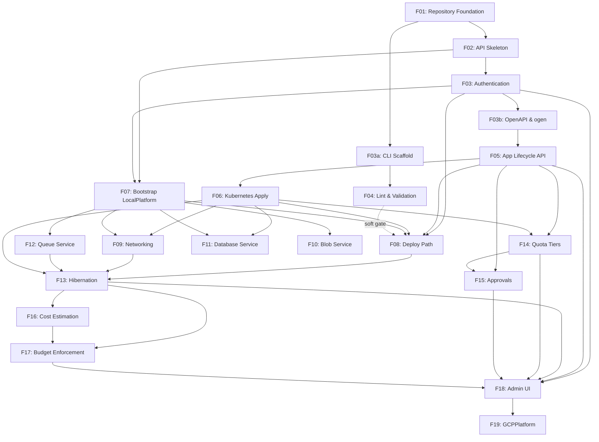

# Implementation Plan

## Approach

**Local-first, platform-abstracted.** All features are built against `LocalPlatform` first. `GCPPlatform` is a separate later feature — a complete Morsel instance runs with no cloud account. This keeps the inner development loop fast and validates the platform abstraction.

**Visible progress first.** Each feature delivers something a user can observe: a running endpoint, a working CLI command, an app that deploys. Stubs and fake implementations are acceptable whenever they unblock the end-to-end visible path.

**Task sizing.** Each task is one PR — a focused, reviewable unit of work with passing tests. Tasks within a feature are ordered by dependency.

---

## Feature Index

| Feature | Title | Status | Depends on |
|---------|-------|--------|------------|
| [F01](001-feature-repository-foundation.md) | Repository Foundation | ✅ done | — |
| [F02](002-feature-api-skeleton.md) | control plane: HTTP Server Skeleton | ✅ done | F01 |
| [F03](003-feature-authentication.md) | Authentication | ✅ done | F02 |
| [F03a](003a-feature-cli-scaffold.md) | CLI Scaffold | ✅ done | F01 |
| [F03b](003b-feature-openapi-ogen.md) | OpenAPI Spec & ogen Code Generation | ✅ done | F03 |
| [F04](004-feature-lint-and-schema-validation.md) | App Lint and Schema Validation | ✅ done | F03a |
| [F05](005-feature-app-lifecycle-api.md) | App Lifecycle: API Layer | ✅ done | F03b |
| [F06](006-feature-kubernetes-manifest-apply.md) | Kubernetes Manifest Apply | ✅ done | F05 |
| [F07](007-feature-bootstrap-local-platform.md) | Bootstrap: LocalPlatform | ✅ done | F02, F03 |
| [F08](008-feature-local-platform-deploy-path.md) | LocalPlatform Deploy Path | ✅ done | F03, F05, F06, F07 |
| [F09](009-feature-networking.md) | Networking | ✅ done | F06, F07 |
| [F10](010-feature-blob-service.md) | Blob Service | ⬜ not started | F07 |
| [F11](011-feature-database-service.md) | Database Service | ⬜ not started | F06, F07 |
| [F12](012-feature-queue-service.md) | Queue Service | ✅ done | F07 |
| [F13](013-feature-hibernation.md) | Hibernation | ⬜ not started | F06, F07, F08, F09, F12 |
| [F14](014-feature-quota-tiers.md) | Quota Tiers | ⬜ not started | F05, F06 |
| [F15](015-feature-approvals.md) | Approvals | ⬜ not started | F05, F14 |
| [F16](016-feature-cost-estimation.md) | Cost Estimation | ⬜ not started | F13 |
| [F17](017-feature-budget-enforcement.md) | Budget Enforcement | ⬜ not started | F13, F16 |
| [F18](018-feature-admin-ui.md) | Admin UI | ⬜ not started | F03, F05, F13, F14, F15, F17 |
| [F19](019-feature-gcp-platform.md) | GCPPlatform | ⬜ not started | F18 (all) |

---

## Dependency Tree

### Parallel tracks (by phase)

| Phase | Features that can run in parallel | Prerequisite |
|-------|-----------------------------------|--------------|
| 0 | F01 | — |
| 1 | **F02**, **F03a** | F01 |
| 2 | **F03**, **F04** | F03 needs F02; F04 needs F03a |
| 3 | **F03b**, **F07** | F03b needs F03; F07 needs F02+F03 |
| 4 | **F05** | F03b |
| 5 | **F06**, **F14** | F05; F06 also needed for F14 so do F06 first |
| 6 | **F08**, **F09**, **F10**, **F11**, **F12** | F06+F07 (F08 also needs F03+F05); F10, F11, F12 need only F07 |
| 7 | **F15** | F15 needs F05+F14 |
| 8 | F13 | F06+F07+F08+F09+F12 |
| 9 | F16 | F13 |
| 10 | F17 | F13+F16 |
| 11 | F18 | F03+F05+F13+F14+F15+F17 |
| 12 | F19 | F18 (all LocalPlatform features stable) |

### Dependency graph (Mermaid)

